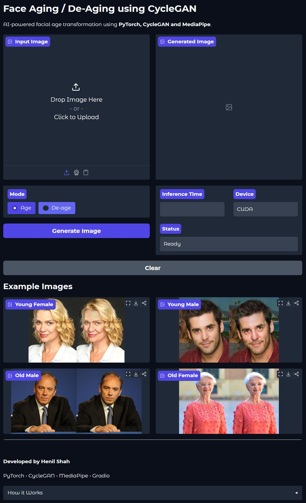
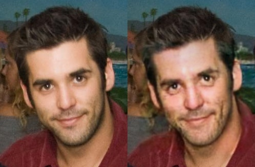
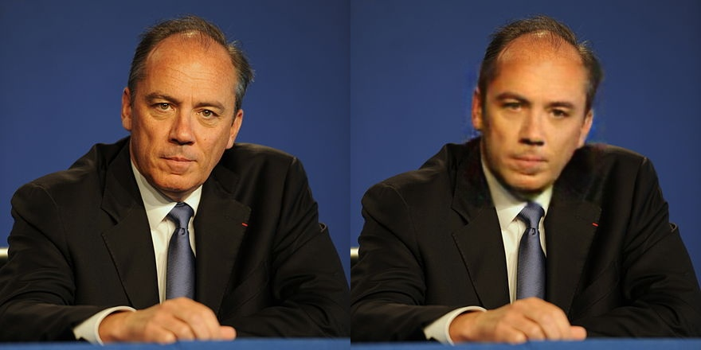
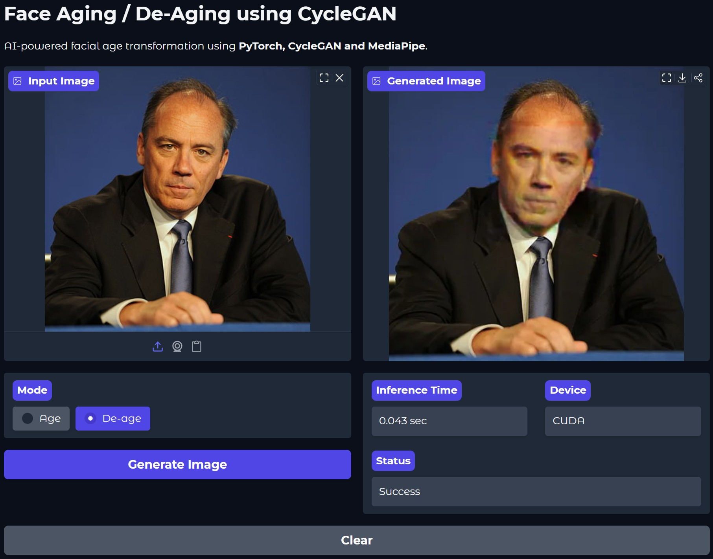

<div align="center">

# Face Aging & De-Aging using CycleGAN

### AI-powered facial age transformation using **PyTorch**, **CycleGAN**, **OpenCV**, and **Gradio**


</div>

---

## Overview

This project implements a complete **Face Aging & De-Aging pipeline** using **CycleGAN**, enabling realistic facial age transformation without requiring paired training data.

The model learns bidirectional mappings between **young** and **old** facial domains using adversarial learning, cycle consistency, and identity preservation losses.

The application includes an interactive **Gradio web interface**, automatic face detection, seamless face blending, and a complete training and inference pipeline built with **PyTorch**.

---

## Table of Contents

- [Overview](#overview)
- [Interface](#interface)
- [Key Features](#key-features)
- [Demo](#demo)
- [Architecture](#architecture)
- [Training](#training)
- [Installation](#installation)
- [Usage](#usage)
- [Project Structure](#project-structure)
- [Results](#results)
- [Future Improvements](#future-improvements)
- [References](#references)
- [Acknowledgements](#acknowledgements)
- [Author](#author)

---

## Interface

<p align="center">

</p>

---

## Key Features

- Realistic **Face Aging**
- Realistic **Face De-Aging**
- CycleGAN implementation from scratch in PyTorch
- Automatic face detection
- Seamless facial blending into the original image
- Interactive Gradio web application
- GPU-supported inference
- Complete training pipeline
- Modular project structure
- Clean and reusable codebase

---

# Demo

## Face Aging

<p align="center">

</p>

<p align="center">
<b>Input (Young Face) → AI Generated Aged Face</b>
</p>

---

## Face De-Aging

<p align="center">

</p>

<p align="center">
<b>Input (Old Face) → AI Generated Young Face</b>
</p>

---

## Web Interface

The project includes a fully interactive **Gradio** application for real-time facial age transformation.

Features of the interface include:

- Upload any face image
- Choose between **Age** and **De-age**
- Real-time inference
- Inference time display
- Device information (CPU / CUDA)
- Status updates
- Progress indicator
- Before/After comparison
- Example images
- Responsive interface

<p align="center">

</p>

---

# Architecture

The complete inference pipeline is shown below.

```text
                    Input Image
                         │
                         ▼
            MediaPipe Face Detection
                         │
                         ▼
              Face Cropping & Alignment
                         │
                         ▼
                 Image Preprocessing
               (Resize + Normalization)
                         │
                         ▼
              CycleGAN Generator Network
             (Age / De-age Transformation)
                         │
                         ▼
               Generated Face Image
                         │
                         ▼
          Resize to Original Face Resolution
                         │
                         ▼
          Seamless Face Blending (OpenCV)
                         │
                         ▼
                    Final Output
```

---

## Project Workflow

The complete pipeline consists of four major stages:

### 1. Face Detection

MediaPipe Face Detection is used to locate the largest face in the image.

The detected face is cropped and resized before being passed to the neural network.

---

### 2. Image Translation

The cropped face is transformed using a CycleGAN Generator.

Depending on the selected mode, the generator performs either:

- Young → Old
- Old → Young

without requiring paired training images.

---

### 3. Face Reconstruction

The generated face is resized back to the original face dimensions.

OpenCV's seamless cloning technique blends the generated face naturally into the original photograph.

---

### 4. Final Output

The resulting image preserves the original background, lighting and identity while modifying only facial age characteristics.

---

## Model Architecture

The project uses a standard CycleGAN consisting of:

- Two Generator Networks
    - Young → Old
    - Old → Young

- Two PatchGAN Discriminators
    - Old Domain
    - Young Domain

The generators learn realistic age translation while the discriminators distinguish generated faces from real images.

Cycle Consistency Loss ensures that translating an image to the opposite domain and back reconstructs the original face, preserving identity and facial structure.

# Training

## Dataset

The model was trained using the **IMDB-WIKI** dataset, one of the largest publicly available facial age datasets.

### Dataset Information

- **Dataset:** IMDB-WIKI
- **Total Images:** 500,000+
- **Image Type:** Celebrity face images
- **Age Labels:** Automatically generated from date of birth and photo year
- **Training Domains:**
  - Young Faces
  - Old Faces

---

## Data Preprocessing

Before training, the dataset was cleaned and filtered to improve data quality.

The preprocessing pipeline included:

- Removing invalid age labels
- Filtering images containing multiple faces
- Discarding low-confidence face detections
- Cropping facial regions
- Resizing images to **128 × 128**
- Normalizing pixel values to **[-1, 1]**

This produced a balanced dataset suitable for CycleGAN training.

---

## Training Configuration

| Parameter | Value |
|-----------|--------|
| Framework | PyTorch |
| Image Size | 128 × 128 |
| Batch Size | 4 |
| Epochs | 100 |
| Optimizer | Adam |
| Learning Rate | 0.0002 |
| Betas | (0.5, 0.999) |
| Device | CUDA GPU |

---

## Loss Functions

The CycleGAN model was trained using three complementary loss functions.

### Adversarial Loss

Encourages generators to produce realistic facial images capable of fooling the discriminators.

```python
nn.MSELoss()
```

---

### Cycle Consistency Loss

Ensures that translating an image to the opposite domain and back reconstructs the original face, preserving identity.

```python
nn.L1Loss()
```

---

### Identity Loss

Helps preserve facial structure and color consistency when the input image already belongs to the target domain.

```python
nn.L1Loss()
```

---

## Generator Objective

The total generator loss is computed as:

```text
Generator Loss =
Adversarial Loss
+ 10 × Cycle Loss
+ 5 × Identity Loss
```

These weights encourage realistic age transformation while maintaining identity and minimizing visual artifacts.

---

## Training Progress

The following samples were generated during training to monitor qualitative improvements over time.

| Epoch | Sample |
|--------|--------|
| 1 | `samples/epoch_1_fake_old.png` |
| 25 | `samples/epoch_25_fake_old.png` |
| 50 | `samples/epoch_50_fake_old.png` |
| 75 | `samples/epoch_75_fake_old.png` |
| 90 | `samples/epoch_90_fake_old.png` |
| 99 | `samples/epoch_99_fake_old.png` |

The generated faces become progressively sharper and more realistic as training proceeds, demonstrating stable adversarial learning and improved age translation quality.

---

# Installation

## 1. Clone the Repository

```bash
git clone https://github.com/henilShah110/face-aging-deaging-project.git

cd face-aging-deaging-project
```

---

## 2. Create a Virtual Environment

### Windows

```bash
python -m venv venv

venv\Scripts\activate
```

### Linux / macOS

```bash
python3 -m venv venv

source venv/bin/activate
```

---

## 3. Install Dependencies

```bash
pip install -r requirements.txt
```

---

## 4. Download the Trained Model

The trained CycleGAN weights are not included in this repository because they exceed GitHub's file size limit.

Download the pretrained model from:

**Google Drive:** *(Add your Google Drive link here)*

Place the downloaded file inside:

```text
checkpoints/latest.pth
```

---

## 5. Run the Gradio Application

```bash
python app.py
```

Open the displayed local URL in your browser.

---

# Usage

1. Upload a face image.

2. Choose one of the available modes:

- **Age**
- **De-age**

3. Click **Generate Image**.

4. The application will:

- Detect the face
- Crop the face
- Perform age transformation
- Blend the generated face back into the original image
- Display the final result

---

## Project Structure

```text
face-aging-deaging-project/
│
├── checkpoints/
├── data/
│   ├── raw/
│   └── processed/
│
├── examples/
├── outputs/
├── samples/
├── screenshots/
│
├── src/
│   ├── dataset/
│   ├── models/
│   ├── training/
│   ├── utils/
│   ├── inference.py
│   └── predict.py
│
├── app.py
├── config.py
├── requirements.txt
└── README.md
```

---

## Repository Contents

- Training pipeline
- Dataset preprocessing
- CycleGAN implementation
- Face detection utilities
- Inference pipeline
- Gradio web interface
- Training samples
- Example images
- Project screenshots

---

# Results

The trained CycleGAN successfully learns bidirectional mappings between young and old facial domains, producing realistic age transformations while preserving facial identity.

### Highlights

- Successfully performs both **Face Aging** and **Face De-Aging**
- Preserves facial identity throughout translation
- Maintains background and overall image composition
- Interactive Gradio interface for real-time inference
- GPU-accelerated inference with CUDA support
- Stable training over **100 epochs**

---

## Technologies Used

| Category | Technologies |
|----------|--------------|
| Programming Language | Python |
| Deep Learning | PyTorch |
| GAN Architecture | CycleGAN |
| Face Detection | MediaPipe |
| Image Processing | OpenCV |
| Dataset | IMDB-WIKI |
| Web Interface | Gradio |

---

# Future Improvements

Several enhancements can further improve the project:

- Train on a larger and more diverse facial dataset
- Generate multiple age groups instead of only young ↔ old
- Preserve additional facial attributes such as hairstyle and accessories
- Improve high-resolution image generation
- Optimize inference speed for real-time applications
- Deploy the application as a cloud-hosted web service
- Experiment with diffusion-based image translation models
- Add video-based face aging support
- Fine-tune the model using perceptual and facial identity losses

---

# References

- Zhu et al., **Unpaired Image-to-Image Translation using Cycle-Consistent Adversarial Networks (CycleGAN)**, ICCV 2017.
- IMDB-WIKI Dataset by ETH Zurich.
- PyTorch Documentation.
- OpenCV Documentation.
- MediaPipe Documentation.
- Gradio Documentation.

---

# Acknowledgements

This project was inspired by the original CycleGAN paper and made possible through the open-source tools and datasets provided by the research community.

Special thanks to:

- The PyTorch Team
- Google MediaPipe
- OpenCV Contributors
- Gradio Developers
- ETH Zurich for the IMDB-WIKI Dataset

---

# Author

**Henil Shah**

Artificial Intelligence Engineering Student

If you found this project helpful, consider ⭐ starring the repository.

---